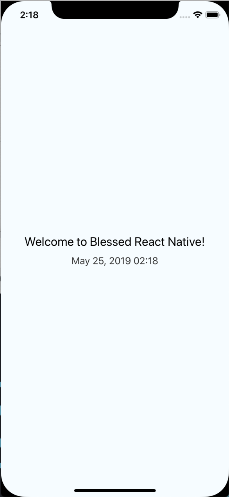
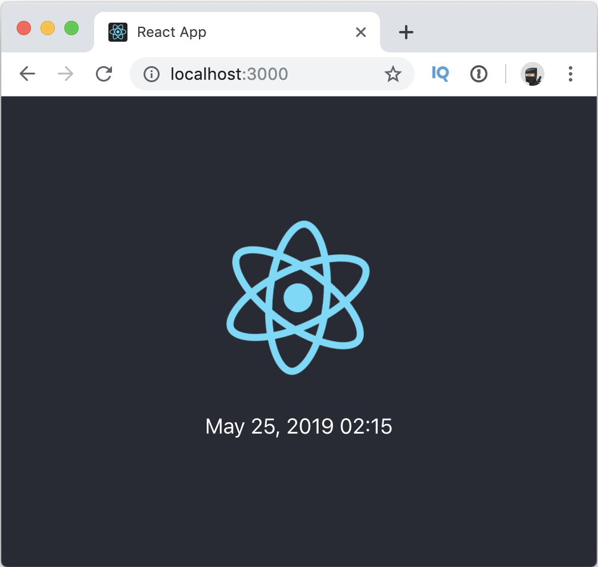

# React Native & React Web monorepo example
You can find the slides of the talk [here](./meta/slides.pdf) in the repo or at [SlideShare](https://www.slideshare.net/2j2e/monorepo-react-web-react-native)

## How to run
**Web (React)**
```
cd packages/web
npm start
```


**Mobile (React Native)**
```
cd packages/mobile
react-native run-ios
```


## How to make same from scratch

**Init repo & Lerna**
```
npm install -g lerna
mkdir monorepo
cd monorepo

# Init Lerna part
lerna init
cd package
```

**Create React web app**
```
npx create-react-app web
# Change the web/package.json name to '@prefix/web'
```

**Create React Native app**
```
react-native init mobile
# Change the mobile/package.json name to '@prefix/mobile'
```
**Create shared code**
```
mkdir shared

# Add 'shared' as a dependency for 'web' and 'mobile'
lerna add @prefix/shared
```